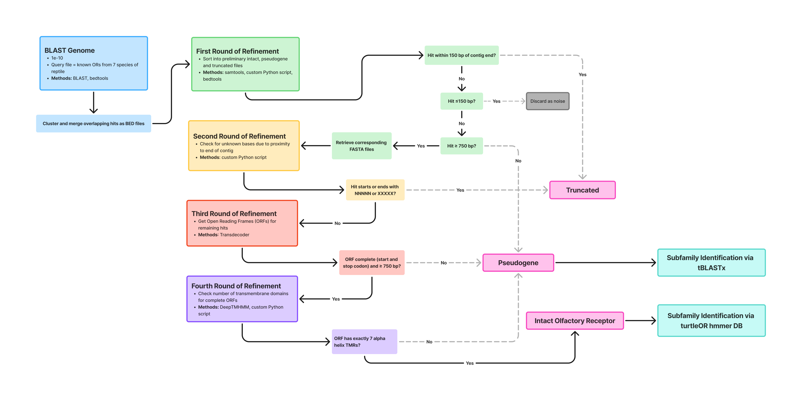

# OR discovery workflow

## This workflow was used to discover, extract, and annotate in Cockrin et al 20xx. OR seqs are annotated to the level of intact, truncated and pseudogene sequences.
### workflow is written in snakemake 7.19.1 with conda environments present in `env/`

### Prerequisites

#### conda
#### snakemake
#### deeptmhmm
A local / academic version of deeptmhmm is needed from `https://dtu.biolib.com/DeepTMHMM`. To install, follow instruction from `https://www.polarmicrobes.org/local-installation-of-deeptmhmm/` with a modification of removing the line `torch==1.5.0+cu92` from `requirements.txt`. Beware deeptmhmm uses all available processors on a computer. 

The variable `DEEPTMHMM_DIR` in the snakemake script will need to be modified to reflect the full path of the deeptmhmm directory.

## Steps to run to replicate results in Cockrin et al 20xx.

1. Enter `genomes/` and run the `get_genomes.sh` bash script to download and unzip turtle genomes.
   - `bash get_genomes.sh`
2. Return to main directory, run the snakemake workflow
   - `snakemake -s OR_discovery.smk --cores 32 --use-conda`

## Results for each species will be in output/<species_prefix>/final/
  - <species_prefix>.complete_intact.fas: full length OR seqs with 7 transmembrane domains in fasta format and includes <species_prefix> in the header
  - <species_prefix>.copmplete_pseudo.bed: genome coordinates of OR genes that failed to meet intact parameters.
  - <species_prefix>.complete_truncated.bed: genome coordinates of OR genes that were too close to the end of a chromosome or assembly gap to assign intact or pseudogene status.

### General flowchart of the OR discory pipeline.

 
