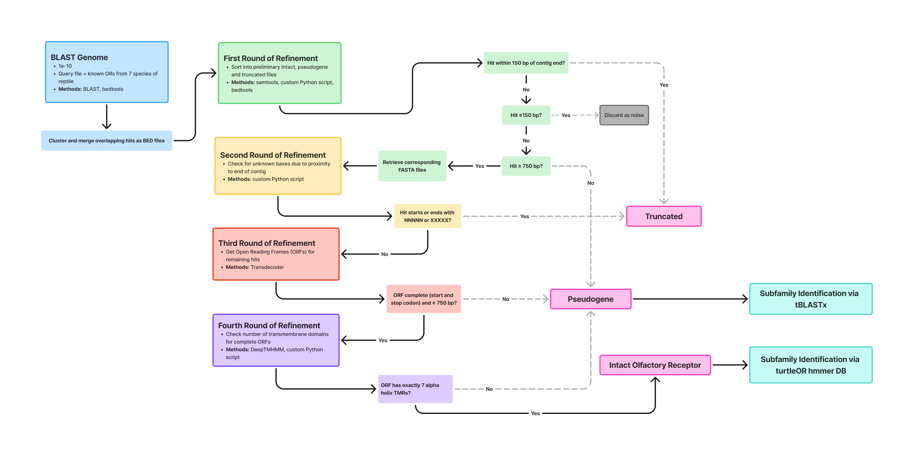

# OR discovery workflow

## This workflow was used to discover, extract, and annotate in Cockrin et al 20xx. OR seqs are extracted from whole genome drafts and annotated to the level of intact, truncated and pseudogene sequences.
### The current workflow is written in snakemake 9.27 utilizing conda environments present in `env/`. The workflow is designed to perform best on a scheduled HPC with slurm, LSF, etc., but could theoretically be run on a local desktop, just very slowly and may require resource re-configuration.

### The following prerequisites are required:

#### conda or mamba
#### snakemake v9
#### A local copy of DeepTMHMM.

### Installing snakemake: 
`conda create -n snakemake -c conda-forge snakemake=9`  

#### I ran this workflow with a slurm scheduler with snakemake-executor-plugins, which required.
`pip install snakemake-executor-plugin-slurm`

#### Howver this may need to be adjusted for your particular HPC and scheduler, i.e.:
`pip install snakemake-executor-plugin-<scheduler>`

### Installing DeepTMHMM:

1. A local academic version of DeepTMHMM is required from: `https://dtu.biolib.com/DeepTMHMM`. 

  - `unzip DeepTMHMM-Academic-License-v1.0.zip`

2. DeepTMHMM is cpu greedy. Once unzipped, you'll need to modify lines in `predict.py`

```
#Update these two lines lines:

torch.set_num_threads(os.cpu_count())
torch.set_num_interop_threads(os.cpu_count() + 2)

#To 
n_threads = int(os.environ.get("DEEPTMHMM_THREADS", 1))

torch.set_num_threads(n_threads)
torch.set_num_interop_threads(n_threads + 2)
```

3. Update the `DEEPTMHMM_DIR` variable in your config file to the full path of your local installation.  


## Table notes

## config file
 
## Steps to run to replicate results in Cockrin et al 20xx.

- `conda install mamba`
   - `mamba create -n snakemake -c bioconda -c conda-forge snakemake=9` 

1. Enter `genomes/` and run the `get_genomes.sh` bash script to download and unzip turtle genomes.
   - `bash get_genomes.sh`
2. Return to main directory, run the snakemake workflow
   - `snakemake -s OR_discovery.smk --cores 32 --use-conda`

## Results for each species will be in output/<species_prefix>/final/
  - <species_prefix>.complete_intact.fas: full length OR seqs with 7 transmembrane domains in fasta format and includes <species_prefix> in the header
  - <species_prefix>.copmplete_pseudo.bed: genome coordinates of OR genes that failed to meet intact parameters.
  - <species_prefix>.complete_truncated.bed: genome coordinates of OR genes that were too close to the end of a chromosome or assembly gap to assign intact or pseudogene status.

### General flowchart of the OR discory pipeline.

 

To annotate ORs for you own purposes, store unique genomes in fasta format in `genomes`, modify `table.csv` to reflect genome names and desired prefixes, provide a query of OR aa sequences in fasta format to replace `query/intact.ORs.fas`
